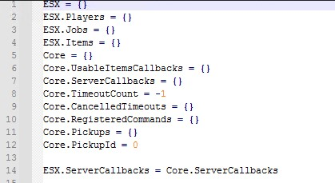

# ESX.ServerCallbacks table is empty
If you get the error `ESX.ServerCallbacks table is empty`, it means that in your es_extended is not using the ESX.ServerCallbacks table. It's probable that the table for the callbacks is `Core.ServerCallbacks`

## Fix
If your **es_extended** is using `Core.ServerCallbacks`, you can fix the problem by adding the following line in `es_extended\server\common.lua`

``` lua
ESX.ServerCallbacks = Core.ServerCallbacks
```

As in the screenshot <br><br>
