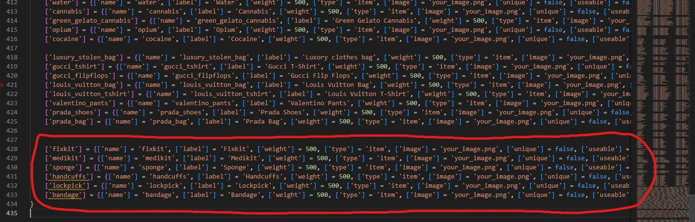

# QB-Core installation tutorial
The installation for **QB-Core** it's a bit longer than the **ESX** one where it's almost all automated

## Adding the items
To add the new items, you have to edit `qb-core/shared/items.lua` file and add at the bottom of the table the following code

```lua
	['fixkit'] = {['name'] = 'fixkit', ['label'] = 'Fixkit', ['weight'] = 500, ['type'] = 'item', ['image'] = 'your_image.png', ['unique'] = false, ['useable'] = false, ['shouldClose'] = false, ['combinable'] = nil},
	['medikit'] = {['name'] = 'medikit', ['label'] = 'Medikit', ['weight'] = 500, ['type'] = 'item', ['image'] = 'your_image.png', ['unique'] = false, ['useable'] = false, ['shouldClose'] = false, ['combinable'] = nil},
	['sponge'] = {['name'] = 'sponge', ['label'] = 'Sponge', ['weight'] = 500, ['type'] = 'item', ['image'] = 'your_image.png', ['unique'] = false, ['useable'] = false, ['shouldClose'] = false, ['combinable'] = nil},
	['handcuffs'] = {['name'] = 'handcuffs', ['label'] = 'Handcuffs', ['weight'] = 500, ['type'] = 'item', ['image'] = 'your_image.png', ['unique'] = false, ['useable'] = false, ['shouldClose'] = false, ['combinable'] = nil},
	['lockpick'] = {['name'] = 'lockpick', ['label'] = 'Lockpick', ['weight'] = 500, ['type'] = 'item', ['image'] = 'your_image.png', ['unique'] = false, ['useable'] = false, ['shouldClose'] = false, ['combinable'] = nil},
	['bandage'] = {['name'] = 'bandage', ['label'] = 'Bandage', ['weight'] = 500, ['type'] = 'item', ['image'] = 'your_image.png', ['unique'] = false, ['useable'] = false, ['shouldClose'] = false, ['combinable'] = nil},
```

### Screenshot example:
[](qb_core_jobs_creator_items.jpg)

## Installing ESX menu
To make the script works, you need to install ESX menu

This esx_menu_default script is edited by the creator of QB-Core framework, you can find it in QBCore Discord server in conversion channel, or directly from this [link](https://cdn.discordapp.com/attachments/837369580921552936/915519378852810762/esx_menu_default.rar)